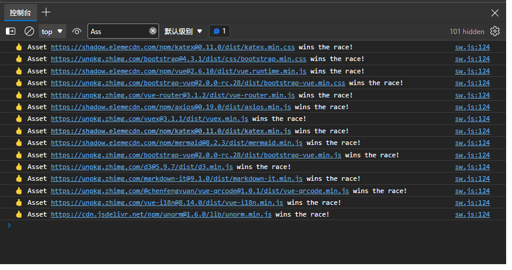

# CDN Racer / CDN 快跑
### 😶 这是什么
这是基于`Service Worker`实现的纯前端CDN替换工具，当`Service Worker`注册成功后，会对在列表内的CDN的GET资源请求进行替换，同时向多个CDN请求资源，并直接返回最快响应的资源内容。
### 🤔 如何使用
只需要在html文件中注册`sw.js`即可.
```html
<script>
    if ('serviceWorker' in navigator) {
        navigator.serviceWorker.register('sw.js',).then(function(reg) {
            // registration worked
            console.log('Registration succeeded. Scope is ' + reg.scope);
        }).catch(function(error) {
            // registration failed
            console.log('Registration failed with ' + error);
        });
    }
</script>
```
参考 [index.html](index.html)
### 😏 效果展示

